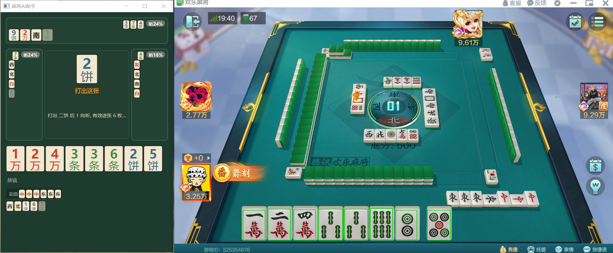

# 🀄 麻将AI助手 (Mahjong AI Assistant)

实时麻将辅助决策系统:通过"看"真实牌桌,重建完整牌局状态,**推断三家对手的隐藏手牌与听牌威胁**,并给出牌效最优的出牌建议。

> 只读辅助 — 不操作游戏、不注入、不修改游戏进程。


## 它解决什么问题

从游戏界面里,要回答三个问题——而每一个都比看起来难:

1. **"桌上有哪些牌?"** — 实时视频检测中,漏检、误检、帧间抖动是常态(牌面小、动画遮挡、低帧率)——任何单帧检测都不可能完美。直接把每帧检测当真相,状态机几分钟就崩。
2. **"这张牌是谁打的?"** — 固定区域划分在线上看似可行,但真实牌局里四家牌河在画面中央交错、物理不可分(上家牌河延伸到我的牌河上方);更本质的是,固定区域方案绑定 UI 坐标,无法迁移到线下实体麻将。只有"出牌轮转 + 落点身份跟踪"的时间方案,同时解决线上交错,又天然适配线下。
3. **"对手手里有什么?"** — 永远看不到。只能从"他打了什么、没打什么"反推——一个信息不完备的贝叶斯推断问题。

**核心思路:不把检测当真相,把不可靠的视觉信号抽象成事件流,再用时间约束做全局解码。**



## 技术难点与方案

| 难点 | 方案 |
|---|---|
| 检测不完美(漏检/误检/抖动是实时 CV 的固有属性) | **事件流抽象**: 牌出现 / 牌河消失 / 手牌数台阶 / 副露信号 — 每类事件多信号交叉确认, 从架构层吸收单帧错误 |
| 牌河归属空间不可分 | **轮转自动机 + beam search 全局解码**: 行动者轮转强先验 + ByteTrack 身份跟踪 + 空间软证据; 软归属 + 8s 冻结窗口 + 翻案快照回放精确修正 |
| 对手手牌不可观测 | **粒子滤波**(3 家 × 400 粒子): 牌效似然(理性玩家不毁牌效出牌)+ 结构化漂移 + 软观测(归属不确定时按概率部分更新); 副露内容用牌池约束反解碰/吃 |
| 实时性(游戏进行中) | 后台推理线程 + 最新帧优先 + GIL 让渡; 逐帧级计时探针定位并消除 ROI 逐框推理瓶颈(60 框 900ms → 8ms 批量) |
| 界面适配 | 三档自适应布局(窄条/牌桌/宽屏)+ 降级链, 任意窗口尺寸不挤不溢出 |

## 系统架构

```
游戏画面 ──截屏──▶ 检测 + 跟踪 + ROI 精修(批量分类)
                        │  每帧 ~60 牌面框
                        ▼
          事件提取: 手牌带锚定 / 牌河消失检测 / 副露台阶签名
                        │  TileAppeared / TileVanished / HandChanged / MeldFormed
                        ▼
          轮转自动机 + beam search 全局归属解码(软归属 + 冻结 + 翻案)
                        ▼
          粒子滤波对手建模: 听牌概率 / 等待牌 / 放铳率
                        ▼
          牌效引擎出牌推荐 ──▶ 自适应 UI 面板
```

## 量化验证

自建合成对局模拟器,真值全程已知,离线对比推断结果(10 局 × 400 粒子):

| 指标 | 结果 | 说明 |
|---|---|---|
| 手牌质量 | **0.95** / 1.0 | 对手真手牌每张的推断期望张数(随机基线 ≈ 0.11) |
| 听牌校准 | 单调 | 分桶预测概率 vs 实际听牌率,各桶实际值落在预测区间内 |
| 等待牌命中 | 33-55% | 实际听牌时,真等待牌在推断 top3 的比例(信息论上限内) |
| 出牌推荐 A/B | 平均向听数更低 | 新算法(向听数 + 有效进张)vs 旧算法 |

评估入口: `uv run python scripts/eval_inference.py`

## 目录结构

```
src/mahjong_cv/        截屏捕获、YOLO 检测 + ByteTrack + ROI 分类、聚类
src/mahjong_ai/pipeline/  事件提取、归属解码器(轮转自动机 + beam search)
src/mahjong_ai/inference/ 粒子滤波对手建模(软观测、快照回放、副露扣池)
src/mahjong_ai/efficiency/ 向听数计算、有效进张出牌推荐
src/mahjong_engine/    可扩展规则引擎(胡牌/听牌/动作判定, 多玩法支持)
src/mahjong_ui/        独立信息面板(三档自适应布局)
scripts/               运行入口、评估、数据标注/训练链
tests/                 359 个测试(单测 + 合成对局端到端回归)
```

## 快速开始

```bash
uv sync                # 安装依赖(含 GPU 版 torch)
uv run pytest          # 359 个测试
uv run mypy src        # 类型检查
uv run ruff check src tests scripts
```

运行实时辅助(需欢乐麻将 PC 客户端已开启):

```bash
uv run python scripts/run_assistant.py
```

> 模型权重与训练数据不在本仓库(`data/` 已排除)。目录约定:
> `data/models/screen/mahjong_screen_detector/weights/best.pt`(检测器)、
> `data/models/roi_cls/weights/best.pt`(ROI 分类器)。
> 训练链: 截图采集 → 人工审核 → 训练(scripts/ 下对应脚本)。
> 首次运行按提示用 `pick_regions.py`(8 区域框选)完成桌面标定。

## 技术栈

| 层次 | 技术 |
|------|------|
| 语言/环境 | Python 3.12 / uv |
| 检测/跟踪 | YOLOv8 + ByteTrack(ultralytics) |
| 牌面分类 | YOLOv8n-cls(ROI 二级精修) |
| 推断 | 粒子滤波(自实现)+ 轮转自动机 + beam search |
| UI | PySide6 (Qt) |
| 质量 | pytest / mypy / ruff |

## 未来规划

- **检测精度重训**: 数据闭环(采集/标注/训练链)已就绪, 将检测 recall 从 74% 提升至 90%+
- **真实对局验证**: 结算核对工具已建, 积累真实对局统计, 用真值校准推断(而非仅合成模拟)
- **四家联合推断**: 三家对手独立建模 → 全局一致性推断(共享牌池/副露互相约束)
- **摸牌预测**: 从"未知槽"升级为摸牌分布预测(结合剩余牌墙与各家牌效)
- **线下场景迁移**: 桌面游戏 → 线下实体麻将(事件驱动记录, 不依赖特定 UI)
- **最终愿景**: 一个通用的"看牌"引擎 — 输入任意牌桌画面, 输出完整对局理解(手牌/威胁/推荐), 可嵌入教学、复盘、观战场景

## 免责声明

仅用于计算机视觉与概率推断的工程学习与个人对局复盘。请勿用于违反游戏服务条款的行为;使用者自行承担相应责任。

## 许可

MIT — 见 [LICENSE](LICENSE)
